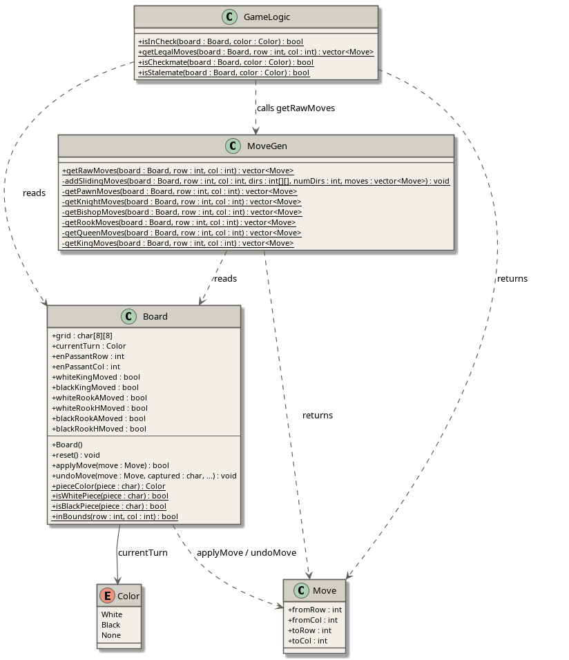
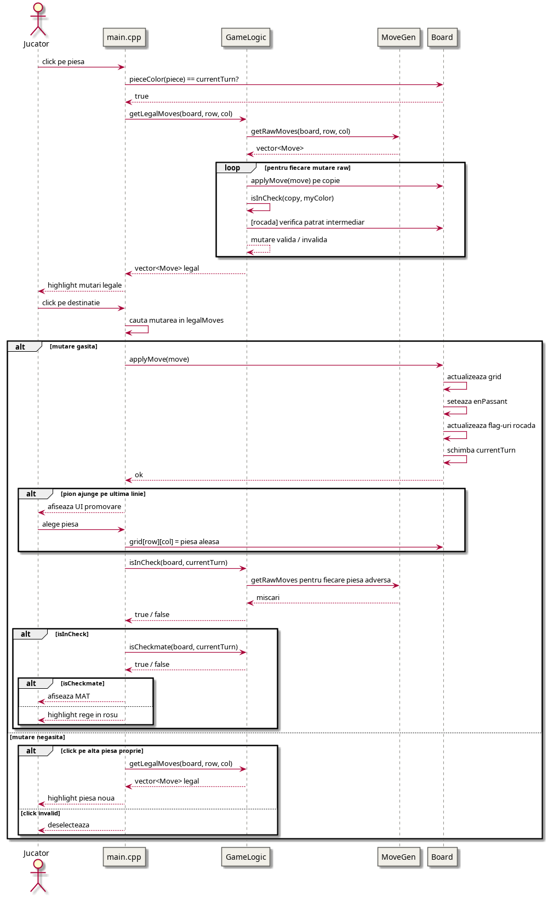
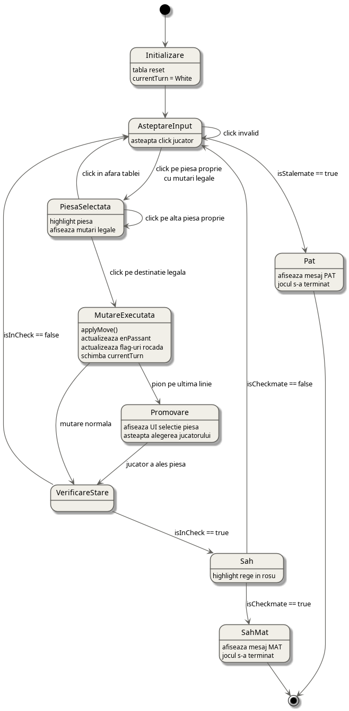

# chess-game-mds

Un joc de șah implementat în C++ cu SFML, cu suport complet pentru regulile jocului.

## Descriere

chess-game-mds este un joc de șah pentru doi jucători pe același calculator. Jocul respectă regulile complete ale șahului, inclusiv rocada, en passant și promovarea pionului. Interfața grafică este construită cu SFML și afișează piese de șah reale, evidențierea mutărilor legale și detecția șahului.

### Funcționalități

- Tablă de șah 8×8 cu piese grafice
- Mutări valide per piesă (pion, cal, nebun, turn, regină, rege)
- Validare mutări — nu poți lăsa regele în șah
- Rocadă mică și mare
- En passant
- Promovare pion cu UI de selecție
- Evidențiere mutări legale la selectarea unei piese
- Highlight rege în șah
- Turn-based (alb → negru → alb)

## Cerințe

- `g++` cu suport C++17
- SFML 2.5+
- Google Test (pentru teste)

```bash
sudo apt install libsfml-dev libgtest-dev g++
```

## Compilare

```bash
# Jocul
make app

# Testele
make run_tests

# Rulare teste
make test
```

## Rulare

```bash
./app
```

Asigură-te că folderul `sprites/` se află în același director cu executabilul.


## Demo
https://www.youtube.com/watch?v=3PBQDutvgRU

## Structura proiectului

```
chess-game-mds/
├── main.cpp
├── Board.h / Board.cpp
├── MoveGen.h / MoveGen.cpp
├── GameLogic.h / GameLogic.cpp
├── Move.h
├── makefile
├── sprites/
│   └── PNGs/
│       └── No shadow/
│           └── 1x/
├── tests/
│   ├── test_board.cpp
│   ├── test_movegen.cpp
│   └── test_gamelogic.cpp
└── docs/
    └── diagrams/
        ├── class_diagram.puml
        ├── sequence_diagram.puml
        └── state_diagram.puml
```

## Diagrame UML

### Class Diagram



### Sequence Diagram



### State Diagram



## CI/CD

Proiectul folosește GitHub Actions pentru CI/CD:

- La fiecare push pe `main` — rulează testele automat
- Dacă testele trec — compilează și publică un release pe GitHub cu executabilul și sprite-urile incluse într-un zip

## Cum se joacă

1. Click pe o piesă proprie pentru a o selecta
2. Pătratele verzi arată mutările legale
3. Click pe un pătrat verde pentru a muta
4. Dacă regele e în șah, pătratul lui devine roșu
5. La promovarea unui pion apare un meniu de selecție

# Raport: Utilizarea AI în dezvoltarea chess-game-mds

## 1. Introducere

Proiectul chess-game-mds este un joc de șah implementat în C++ cu SFML, dezvoltat cu asistența unui model de limbaj (LLM). Acest raport descrie modul în care AI a fost utilizat pe parcursul dezvoltării și cum funcționează cei doi agenți AI integrați în aplicație.

---

## 2. Utilizarea AI în dezvoltarea proiectului

### 2.1 Generarea de cod

AI a fost folosit pentru generarea majorității componentelor proiectului, inclusiv:

- **Structura de bază** — clasa `Board` cu reprezentarea tablei ca matrice `char[8][8]`, enum-ul `Color`, și structura `Move`
- **Generarea mutărilor** — clasa `MoveGen` cu funcții separate pentru fiecare tip de piesă: pion, cal, nebun, turn, regină, rege
- **Logica jocului** — clasa `GameLogic` cu funcții pentru detecția șahului, șah mat și pat
- **Reguli avansate** — rocada, en passant și promovarea pionului cu UI de selecție
- **Botul de șah** — algoritmul minimax cu alpha-beta pruning și Piece-Square Tables
- **Analiza partidei** — clasele `GameHistory` și `Analysis` pentru înregistrarea și evaluarea mutărilor

### 2.2 Debugging și corectarea erorilor

AI a fost folosit pentru identificarea și rezolvarea erorilor de compilare și logică, printre care:

- Erori de compilare (`tolower` nedeclarat, variabile neutilizate, redefiniri de funcții)
- Erori de linking (fișiere `.cpp` lipsă la compilare)
- Bug-uri logice în evaluarea poziției (perspectivele înversate în analiza partidei)
- Probleme de performanță (fereastra `not responding` din cauza calculului blocant)

### 2.3 Arhitectură și design

AI a propus și implementat:

- Separarea codului în fișiere distincte (`Board`, `MoveGen`, `GameLogic`, `Bot`, `GameHistory`, `Analysis`)
- Structura `MoveRecord` pentru salvarea istoricului partidei
- Sistemul de clasificare a mutărilor în trei categorii: Inaccuracy, Mistake, Blunder
- Pipeline-ul CI/CD cu GitHub Actions pentru rularea automată a testelor și publicarea release-urilor

### 2.4 Generarea testelor

AI a generat teste unitare cu Google Test pentru:

- Clasa `Board` — inițializare, detectarea culorii, aplicarea mutărilor, en passant
- Clasa `MoveGen` — mutările fiecărui tip de piesă, rocada
- Clasa `GameLogic` — detecția șahului, șah mat, pat, filtrarea mutărilor ilegale
- Clasa `Bot` — capturi evidente, evitarea sacrificiilor de piese

### 2.5 Documentație

AI a generat:

- `README.md` cu descrierea proiectului, instrucțiuni de compilare și rulare
- Diagrame UML în PlantUML și Mermaid (class diagram, sequence diagram, state machine diagram)

### 2.6 Limitări observate

Pe parcursul dezvoltării au fost identificate câteva limitări ale asistenței AI:

- Erorile de perspectivă în evaluarea poziției au necesitat mai multe iterații pentru a fi rezolvate corect
- Testele generate inițial pentru bot aveau poziții prea permisive, botul alegând mutări poziționale în loc de capturi evidente
- Unele bug-uri subtile (ordinea condițiilor în `classify`) au fost introduse chiar de AI și au necesitat debugging manual

---

## 3. Agentul AI de șah (Botul)

### 3.1 Descriere generală

Botul de șah este implementat în clasa `Bot` și joacă ca negru împotriva jucătorului uman. Folosește algoritmul **minimax cu alpha-beta pruning** pentru a găsi cea mai bună mutare la fiecare rând.

### 3.2 Algoritmul Minimax

Minimax este un algoritm de căutare pentru jocuri cu doi jucători cu sumă zero. Ideea de bază este:

- **Maximizatorul** (botul) încearcă să maximizeze scorul
- **Minimizatorul** (adversarul) încearcă să minimizeze scorul
- Algoritmul explorează toate mutările posibile până la o adâncime fixă (`depth = 3`)

```
minimax(pozitie, adancime, esteMaximizator):
    daca adancime == 0 sau joc terminat:
        returneaza evaluare(pozitie)
    
    daca esteMaximizator:
        best = -infinit
        pentru fiecare mutare:
            score = minimax(mutare, adancime-1, false)
            best = max(best, score)
        returneaza best
    altfel:
        best = +infinit
        pentru fiecare mutare:
            score = minimax(mutare, adancime-1, true)
            best = min(best, score)
        returneaza best
```

### 3.3 Alpha-Beta Pruning

Alpha-beta pruning este o optimizare a minimax care elimină ramurile ce nu pot influența decizia finală. Reduce complexitatea de la O(b^d) la O(b^(d/2)), unde b este numărul de mutări posibile și d este adâncimea.

- **Alpha** — cel mai bun scor pe care maximizatorul îl poate garanta
- **Beta** — cel mai bun scor pe care minimizatorul îl poate garanta
- Dacă `beta <= alpha`, ramura curentă este tăiată (pruning)

### 3.4 Funcția de evaluare

Evaluarea poziției combină două componente:

**Material** — suma valorilor pieselor rămase pe tablă:

| Piesă | Valoare |
|-------|---------|
| Pion | 100 pts |
| Cal | 320 pts |
| Nebun | 330 pts |
| Turn | 500 pts |
| Regină | 900 pts |
| Rege | 20000 pts |

**Piece-Square Tables (PST)** — bonus/malus pozițional pentru fiecare piesă în funcție de pătratul ocupat. De exemplu:

- Calul primește +20 în centru și -50 în colțuri
- Pionul primește +50 pe rândul 2 (aproape de promovare)
- Regele primește penalizare mare în centru (siguranță)

Scorul final: `evaluate = Σ(valoare_piesa + bonus_pozitional)` pentru piesele botului minus același calcul pentru adversar.

### 3.5 Detecția sfârșitului de joc

Minimax verifică la fiecare nod:

- **Șah mat** — returnează `+100000 + depth` (bonus pentru mat mai rapid) sau `-100000 - depth`
- **Pat** — returnează `0`
- **Depth 0** — returnează evaluarea statică a poziției

---

## 4. Agentul AI de analiză a partidei

### 4.1 Descriere generală

Agentul de analiză este implementat în clasa `Analysis` și rulează după terminarea partidei. Evaluează fiecare mutare a jucătorului uman și o clasifică în funcție de calitatea ei.

### 4.2 Fluxul de analiză

Pentru fiecare mutare din istoricul partidei:

1. **Calculează scorul mutării jucate** — rulează minimax din poziția înainte de mutare, aplică mutarea jucată și evaluează rezultatul
2. **Calculează scorul celei mai bune mutări** — rulează `getBestMoveWithScore` care găsește mutarea optimă și returnează scorul ei
3. **Calculează pierderea** — `loss = evalBest - evalAfter`
4. **Clasifică mutarea** — în funcție de pierdere

### 4.3 Clasificarea mutărilor

| Categorie | Simbol | Condiție |
|-----------|--------|----------|
| Good | — | loss < 100 pts |
| Inaccuracy | !? | loss >= 100 pts (1 pion) |
| Mistake | ? | loss >= 250 pts (2.5 pioni) |
| Blunder | ?? | loss >= 500 pts (5 pioni) sau mat ratat |

Cazuri speciale:
- Dacă mutarea jucată dă **șah mat** → clasificată automat ca `Good`
- Dacă exista **mat disponibil** dar nu a fost jucat → clasificată automat ca `Blunder`

### 4.4 Consistența evaluării

O problemă cheie în implementare a fost asigurarea că `evalAfter` și `evalBest` sunt calculate din aceeași perspectivă. Soluția folosită:

- `scoreMoveWithMinimax` — calculează scorul unei mutări specifice folosind minimax
- `getBestMoveWithScore` — găsește cea mai bună mutare și returnează scorul ei din aceeași căutare

Ambele funcții folosesc același algoritm și aceeași perspectivă, garantând că `loss = evalBest - evalAfter >= 0` întotdeauna.

### 4.5 Interfața de analiză

După terminarea partidei, interfața grafică afișează:

- O tablă de șah cu poziția din momentul mutării analizate
- Highlight colorat pe mutarea jucată (roșu = blunder, portocaliu = mistake, galben = inaccuracy, verde = good)
- Highlight verde pe destinația celei mai bune mutări (doar pentru mutări greșite)
- Panel lateral cu clasificarea, notația mutării jucate și cea mai bună alternativă
- Listă cu toate mutările analizate, navigabilă cu tastele A/D

---

## 5. Concluzie

Utilizarea AI în dezvoltarea proiectului a accelerat semnificativ procesul de implementare, în special pentru componentele algoritmice complexe (minimax, alpha-beta pruning, analiza partidei). Interacțiunea iterativă cu modelul a permis identificarea și rezolvarea bug-urilor pe parcurs, deși unele probleme de logică subtile au necesitat mai multe runde de debugging. Rezultatul final este o aplicație funcțională cu două componente AI distincte: un bot de șah bazat pe minimax și un agent de analiză post-partidă.